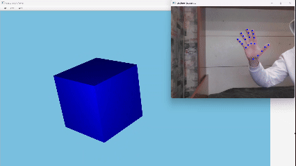

# Gesture3D Viewer

Gesture3D Viewer - desktop-приложение для управления 3D-сценой с помощью жестов рук, считываемых с веб-камеры.

Проект состоит из Python-backend и JavaFX-frontend. Backend получает изображение с камеры, распознает руки через MediaPipe/OpenCV, определяет пользовательские жесты и отправляет события через ZeroMQ. Frontend получает эти события и применяет их к 3D-сцене: вращает объект, двигает камеру, меняет масштаб и выполняет служебные действия.

## Пример работы



## Идея проекта

Пользователь управляет 3D-моделью с помощью естественных движений руки перед камерой: поворот кисти вращает модель, сведение двух рук приближает, движение - перемещает сцену. Никаких дополнительных контроллеров - только обычная веб-камера.

## Статус проекта

Проект находится в активной разработке. Текущая версия - рабочий прототип, в котором основной фокус сделан на распознавание жестов, передачу событий между процессами и управление 3D-сценой.

Планируется добавить:

- загрузку произвольных 3D-моделей вместо временного куба;
- полноценный графический интерфейс;
- настройки чувствительности распознавания движения рук внутри приложения;
- конфигурацию камеры и путей к ресурсам;
- автоматические тесты для геометрических проверок и детекторов жестов;
- более удобную сборку и запуск проекта.

## Возможности

- Захват изображения с веб-камеры.
- Распознавание рук и ключевых точек через MediaPipe.
- Собственные распознаватели (детекторы) для жестов поверх MediaPipe landmarks.
- Передача событий из Python в Java через ZeroMQ.
- Управление JavaFX 3D-сценой в реальном времени.
- Ручное управление клавиатурой и колесом мыши для отладки frontend.

Поддерживаемые события жестов:

- `rotate` - вращение модели вокруг осей X/Y.
- `rotate_z` - вращение модели вокруг оси Z.
- `camera_pan` - перемещение камеры.
- `camera_scale` - приближение или отдаление камеры.
- `reset_view` - сброс положения камеры.
- `screenshot` - временное действие-заглушка в текущей версии frontend.

## Стек

Backend:

- Python
- MediaPipe
- OpenCV
- NumPy
- PyZMQ

Frontend:

- Java
- JavaFX
- Maven
- JeroMQ
- Jackson

Планируемые технологии:

- JAssimp - загрузка произвольных 3D-моделей.

## Структура проекта

```text
.
├── backend
│   ├── resources/models/gesture_recognizer.task
│   ├── requirements.txt
│   └── src
│       ├── main.py
│       ├── datasender.py
│       ├── gesture_handler.py
│       ├── gesture_detectors
│       └── gesture_recognizing
└── frontend
    └── gesture3DViewer
        ├── pom.xml
        ├── mvnw
        ├── mvnw.cmd
        └── src/main
```

## Запуск

На данный момент Frontend и backend запускаются как два отдельных процесса. Обычно удобнее сначала запустить JavaFX-приложение, а затем backend с распознаванием жестов.

### Backend

Из корня репозитория:

```powershell
cd backend
python -m venv venv
.\venv\Scripts\Activate.ps1
python -m pip install -r requirements.txt
```

Backend запускается как Python-модуль из директории `backend`:

```powershell
python -m src.main
```

Сейчас backend по умолчанию открывает камеру с индексом `1` и публикует события на `tcp://*:5555`.

### Frontend

Из корня репозитория:

```powershell
cd frontend\gesture3DViewer
.\mvnw.cmd javafx:run
```

Frontend подписывается на `tcp://localhost:5555` и применяет входящие gesture-события к JavaFX 3D-сцене.

## Ручное управление

В JavaFX viewer есть ручное управление для отладки без жестов:

- стрелки - вращение модели вокруг X/Y;
- `A` / `D` - вращение вокруг Z;
- `G` / `J` - движение камеры по горизонтали;
- `Y` / `H` - движение камеры по вертикали;
- колесо мыши - изменение масштаба;
- Backspace - сброс вида.

## Основные файлы

- `backend/src/main.py` - точка входа backend.
- `backend/src/datasender.py` - отправка gesture-событий через ZeroMQ.
- `backend/src/gesture_handler.py` - выбор активного детектора жестов.
- `backend/src/gesture_detectors` - detector-классы для отдельных жестов.
- `backend/src/gesture_recognizing/utils` - геометрические проверки landmarks.
- `frontend/gesture3DViewer/src/main/java/com/line4kk/gesture3dviewer/Application.java` - точка входа JavaFX-приложения.
- `frontend/gesture3DViewer/src/main/java/com/line4kk/gesture3dviewer/DataReceiver.java` - прием gesture-событий из backend.
- `frontend/gesture3DViewer/src/main/java/com/line4kk/gesture3dviewer/SceneController.java` - управление 3D-сценой.

## Roadmap

- Убрать hardcode настроек камеры, порта и путей.
- Добавить загрузку 3D-моделей.
- Реализовать полноценную панель настроек в интерфейсе.
- Реализовать настоящий экспорт скриншотов вместо временной заглушки.
- Добавить unit-тесты для geometry helpers и gesture detectors.
- Собрать Docker-контейнер.
